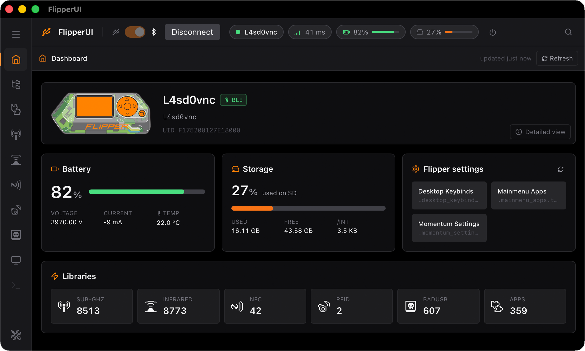

# FlipperUI

<p align="center">
  
</p>

<p align="center">
  <strong>A fast, native desktop manager for Flipper Zero.</strong>
  <br>
  File browsing, signal libraries, app management, live screen control, and CLI access in one focused Tauri app.
</p>

<p align="center">
  
  
  
  
  
  
</p>

FlipperUI is built for people who use their Flipper Zero often and want a desktop app that feels quick, organized, and practical. It uses a Rust backend for Flipper RPC over USB/BLE and a React frontend for a modern, keyboard-friendly interface.

> FlipperUI is pre-release software. The app is actively evolving and is currently tested most heavily on macOS.

<p align="center">
  
</p>

## Highlights

- **Native Flipper Zero connection manager** with USB serial and BLE support, port detection, remembered devices, reconnect handling, battery, storage, and latency indicators.
- **Full file explorer** for browsing `/ext` and `/int`, with upload, download, rename, delete, mkdir, breadcrumb navigation, progress reporting, cancelable transfers, and drag-and-drop upload.
- **Organized signal libraries** for Sub-GHz, Infrared, NFC, RFID, and BadUSB files, with recursive scans, parsed metadata, filtering, cached indexes, and offline browsing after a scan.
- **App library** for `.fap` files, including recursive app scans, categories, embedded icon extraction, drag-and-drop install, and launch/exit support.
- **Live screen viewer** with real-time 128x64 display mirroring, keyboard/D-pad input, long-press support, screenshots, and GIF recording.
- **Serial CLI terminal** with streaming output, command history, and Ctrl+C support for power users.
- **Dashboard and search tools** with device stats, library counts, global search, and a command palette for quick navigation and actions.
- **Desktop integration** with tray/menubar controls, OS notifications, app settings, and developer diagnostics for inspecting protobuf traffic.

## Feature Tour

| Area | What it does |
| --- | --- |
| Dashboard | Shows connected device, firmware, battery, SD usage, `/int` usage, and library counts. |
| File Explorer | Browse, upload, download, rename, delete, create folders, and extract tar archives on the Flipper. |
| Libraries | Index and search Sub-GHz, Infrared, NFC, RFID, BadUSB, and Apps with parsed file-specific metadata. |
| Screen | Mirror the Flipper screen, send button input, capture PNG screenshots, and export short GIF recordings. |
| Terminal | Use the Flipper CLI over USB from inside the app. |
| Search | Find indexed library items and files in the current directory without switching views manually. |
| Settings | Configure scan exclusions, extra app roots, tray behavior, notifications, and diagnostics. |

## Install

### Option 1: Download a release

If a packaged build is available, download the latest installer for your platform from this repository's **Releases** page.

- **macOS:** open the `.dmg` or `.app` bundle.
- **Windows:** run the `.msi` or `.exe` installer.
- **Linux:** use the provided AppImage, `.deb`, or `.rpm` package if published.

**Disclaimer:** Because FlipperUI is still pre-release, some builds may be unsigned. If your OS blocks the first launch, allow it from your system security settings only if you trust the source of the downloaded artifact.

Use this command if you're still having trouble opening FlipperUI:

```bash
cd /Applications
xattr -d com.apple.quarantine FlipperUI.app
```

### Option 2: Run from source

Install the prerequisites:

- **Node.js 18+** with `npm`
- **Rust stable** through `rustup`
- **Tauri v2 system dependencies** for your OS: [Tauri prerequisites](https://v2.tauri.app/start/prerequisites/)

Then run:

```bash
git clone https://github.com/fuckmaz/FlipperUI.git
cd FlipperUI
npm install
npm run tauri dev
```

The first launch compiles the Rust backend. Later launches reuse the build cache and hot-reload the frontend.

## Build

Create a production desktop bundle:

```bash
npm install
npm run tauri build
```

Build artifacts are written under:

```text
src-tauri/target/release/bundle/
```

Frontend-only build:

```bash
npm run build
```

## Development

Useful commands from the repository root:

| Command | Purpose |
| --- | --- |
| `npm run tauri dev` | Run the full desktop app with Vite and Tauri. |
| `npm run dev` | Run only the Vite frontend server. |
| `npm run build` | Type-check and build the frontend. |
| `npm run typecheck` | Run TypeScript without emitting files. |
| `npm run lint` | Run ESLint. |
| `cargo check --manifest-path src-tauri/Cargo.toml` | Check the Rust backend. |
| `cargo test --manifest-path src-tauri/Cargo.toml` | Run Rust tests. |
| `cargo clippy --manifest-path src-tauri/Cargo.toml --all-targets -- -D warnings` | Run optional Rust linting. |

## Architecture

FlipperUI is a Tauri v2 application:

```text
React + Vite + TypeScript          Rust + Tauri v2
src/                               src-tauri/src/
  components/                        commands/
  hooks/                             flipper/
  lib/tauri.ts                       state.rs
  store/useFlipperStore.ts

        Tauri invoke/events
                |
                v
    Flipper RPC over USB serial or BLE
```

- Frontend state lives in `src/store/useFlipperStore.ts`.
- Tauri invoke wrappers live in `src/lib/tauri.ts`.
- Storage orchestration lives in `src/hooks/useStorage.ts`.
- Rust command handlers live in `src-tauri/src/commands/`.
- Flipper protocol framing, storage, GUI, CLI, BLE, and session logic live in `src-tauri/src/flipper/`.
- Protobuf bindings are generated at build time from `src-tauri/proto/`; no system `protoc` install is required.

## Notes

- USB serial is the primary transport and supports the full feature set.
- BLE supports file and library workflows, but the CLI is USB-only.
- Flipper RPC writes are generally intended for `/ext`; some firmware rejects writes to `/int`.
- Close qFlipper or other serial monitors before connecting, because only one app can hold the serial port.

## Contributing

Issues, bug reports, and focused pull requests are welcome.

Please keep changes scoped and include enough detail to reproduce device-specific bugs, including OS, Flipper firmware version, transport type, and relevant logs when possible.

in love - maz <3

## Star History (:

[](https://app.repohistory.com/star-history)

## License

FlipperUI is licensed under the [PolyForm Noncommercial License 1.0.0](./LICENSE).

You're free to use, modify, and distribute it for any **noncommercial** purpose — personal projects, hobby use, research, education, and noncommercial organizations are all permitted. Commercial use is not allowed under this license; if you'd like to use FlipperUI commercially, please reach out to discuss licensing.
